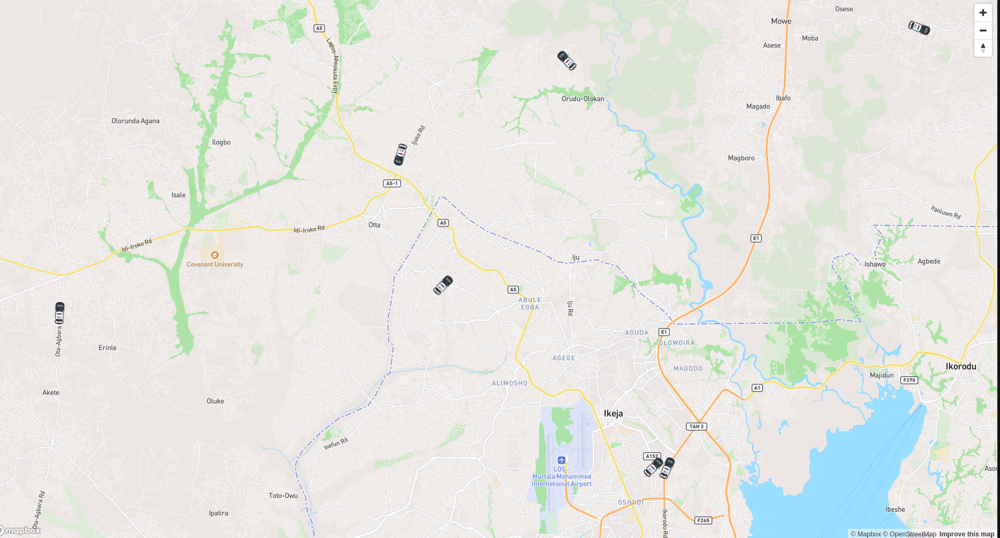
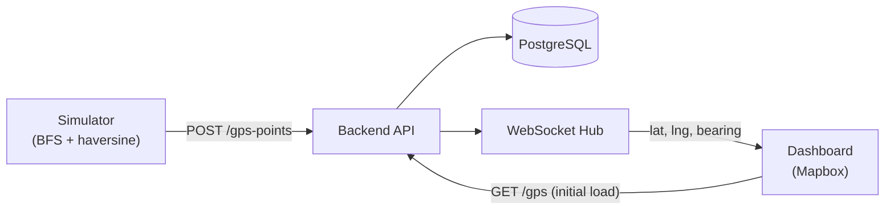

# Beacon



Real-time vehicle tracking system. Simulates GPS-equipped vehicles moving across Lagos road network and streams their positions to a live map dashboard.

## How it works



1. **Backend** seeds the database and exposes a REST API for vehicles, GPS devices, and GPS points.
2. **Simulator** fetches all registered GPS devices, builds a road graph from Lagos OSM data, and moves each vehicle independently along BFS-computed paths. Each tick sends the vehicle's new position and bearing to the API.
3. **API** saves each GPS point and broadcasts it over WebSocket.
4. **Dashboard** renders vehicle markers on a Mapbox map. Markers appear on first REST load (if a last coordinate exists) or on first WebSocket ping. Each marker rotates to face its direction of travel.

## Stack

| Layer     | Tech                                                  |
| --------- | ----------------------------------------------------- |
| Backend   | Go, `net/http`, `gorilla/websocket`, PostgreSQL       |
| Simulator | Go, BFS pathfinding, `paulmach/osm` (OSM PBF parsing) |
| Dashboard | SolidJS, Vite, Mapbox GL JS, TanStack Query           |

## Getting started

### Prerequisites

- Go 1.21+
- Node.js 18+
- PostgreSQL
- Mapbox access token

### Backend

Create a `.env` file in `backend/`:

```env
PORT=8080
DB_HOST=localhost
DB_PORT=5432
DB_USER=postgres
DB_PASSWORD=yourpassword
DB_NAME=beacon
```

```bash
cd backend
go run cmd/api/main.go
```

### Simulator

Requires the Lagos OSM PBF file at `backend/cmd/simulator/map_data/lagos.osm.pbf`.

```bash
cd backend
go run cmd/simulator/main.go
```

### Dashboard

Create a `.env` file in `dashboard/`:

```env
VITE_API_BASE_URL=http://localhost:8080
VITE_WS_URL=ws://localhost:8080/ws
VITE_MAPBOX_ACCESS_TOKEN=your_mapbox_token
```

```bash
cd dashboard
npm install
npm run dev
```

## API

| Method   | Path            | Description                                                    |
| -------- | --------------- | -------------------------------------------------------------- |
| `GET`    | `/health`       | Check API health                                               |
| `GET`    | `/vehicles`     | List all vehicles                                              |
| `POST`   | `/vehicles`     | Create a vehicle                                               |
| `DELETE` | `/vehicles/:id` | Delete a vehicle                                               |
| `GET`    | `/gps`          | List all GPS devices (with last coordinate)                    |
| `POST`   | `/gps`          | Register a GPS device                                          |
| `DELETE` | `/gps/:id`      | Delete a GPS device                                            |
| `POST`   | `/gps-points`   | Record a GPS point (triggers WS broadcast)                     |
| `GET`    | `/gps-points`   | List all GPS points                                            |
| `GET`    | `/ws`           | WebSocket — streams `{ gps_id, latitude, longitude, bearing }` |
