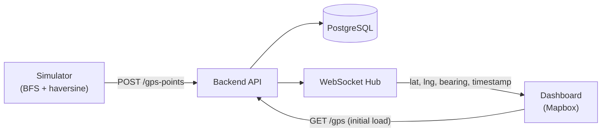

# Beacon


Real-time vehicle tracking system. Simulates GPS-equipped vehicles moving across Lagos road network and streams their positions to a live map dashboard.

## How it works


```mermaid
flowchart LR
    Sim["Simulator\n(BFS + haversine)"]
    API["Backend API"]
    DB[("PostgreSQL")]
    WS["WebSocket Hub"]
    Dash["Dashboard\n(Mapbox)"]

    Sim -->|"POST /gps-points"| API
    API --> DB
    API --> WS
    WS -->|"lat, lng, bearing, timestamp"| Dash
    Dash -->|"GET /gps (initial load)"| API
```

1. **Backend** seeds the database and exposes a REST API for vehicles, GPS devices, and GPS points.
2. **Simulator** fetches all registered GPS devices, builds a road graph from Lagos OSM data, and moves each vehicle independently along BFS-computed paths. Sends the vehicle's new position, bearing, and timestamp to the API. New GPS devices are detected and picked up automatically using Server-Sent Events.
3. **API** saves each GPS point and broadcasts it over WebSocket.
4. **Dashboard** renders vehicle markers on a Mapbox map. Markers appear on first REST load (if a last coordinate exists) or on first WebSocket ping. Each marker rotates to face its direction of travel and holds the correct bearing as the map is rotated. Clicking a marker loads its GPS history and draws the route on the map; the route grows in real time as the vehicle moves.

## Stack

| Layer     | Tech                                                                          |
| --------- | ----------------------------------------------------------------------------- |
| Backend   | Go, `net/http`, `go-chi/chi`, `gorilla/websocket`, PostgreSQL, Huma           |
| Simulator | Go, BFS pathfinding, `paulmach/osm` (OSM PBF parsing)                        |
| Dashboard | SolidJS, Vite, Mapbox GL JS, TanStack Query, Axios, openapi-generator client |

## Getting started

### Prerequisites

- Docker + Docker Compose — for the containerised backend
- Go 1.26+ — only if running the backend outside Docker
- Node.js 18+ — the dashboard always runs on the host
- Mapbox access token
- The Lagos OSM PBF file at `backend/cmd/simulator/map_data/lagos.osm.pbf`. It is LFS-tracked, so
  `git lfs pull` after cloning — a plain clone leaves a 133-byte pointer in its place, and the
  simulator fails with `osmgraph: scan error: blobHeader size >= 64Kb`. It can also be downloaded
  from the [`map-data` release](https://github.com/ize-302/beacon/releases/tag/map-data).

### Environment files

Copy `backend/.env.example` to `backend/.env`:

```env
DB_HOST=beacon_db
DB_PORT=5432
POSTGRES_USER=postgres
POSTGRES_PASSWORD=postgres
POSTGRES_DB=beacon

PORT=8080
API_BASE_URL=http://127.0.0.1:8080
```

`DB_HOST`/`DB_PORT` above are written for **Docker**, where the backend reaches Postgres by
service name on the container network. To run the backend on the host instead, point them at the
published port — `DB_HOST=localhost` and `DB_PORT=5433` (see the ports table below).

Compose also reads this file to provision the database, so `POSTGRES_USER`, `POSTGRES_PASSWORD`,
and `POSTGRES_DB` must be set or `docker compose` refuses to start. In deployment, a single
`DATABASE_URL` overrides all five database variables.

Create a `.env` file in `dashboard/`:

```env
VITE_API_BASE_URL=http://localhost:8080
VITE_WS_URL=ws://localhost:8080/ws
VITE_MAPBOX_ACCESS_TOKEN=your_mapbox_token
```

### Run the backend with Docker (recommended)

From `backend/`:

```bash
docker compose up --build
```

This starts three containers — Postgres, the API, and the simulator — each as a single process.
The API waits for the database to pass its health check, and the simulator waits for the API to
pass its own before it starts posting positions. Source is bind-mounted, so `air` live-reloads
both Go services on save.

```bash
docker compose up beacon_backend      # api + database only, no simulator
docker compose logs -f beacon_simulator
docker compose down                   # add -v to also drop the database volume
```

The dashboard is not containerised — run it on the host alongside the stack:

```bash
cd dashboard && npm install && npm run dev
```

### Run everything on the host

Set `DB_HOST=localhost` and `DB_PORT=5433` in `backend/.env` first, and make sure a Postgres is
listening there (`docker compose up beacon_db` will do).

```bash
# API, with live reload
cd backend && make api

# Simulator (separate terminal)
cd backend && make sim

# Dashboard (separate terminal)
cd dashboard && npm install && npm run dev
```

`make dev` runs the API and simulator together in one terminal.

Without live reload:

```bash
cd backend && go run ./cmd/api
cd backend && go run ./cmd/simulator
```

The simulator resolves the OSM file relative to the working directory, so run it from `backend/`.

### Ports

| Service   | In Docker                | From the host    |
| --------- | ------------------------ | ---------------- |
| API       | `beacon_backend:8080`    | `localhost:8080` |
| Postgres  | `beacon_db:5432`         | `localhost:5433` |
| Dashboard | not containerised        | `localhost:5173` |

Postgres is published on **5433** to avoid clashing with a local Postgres on 5432.

## Deploying to Railway

One-time setup. After this, every push to the deployed branch redeploys automatically.

`docker-compose.yml` is **not** used by Railway — it builds `backend/Dockerfile` directly, and
with no `--target` that means the final `prod` stage.

### 1. Create the services

Four services in one project:

| Service     | Source                        | Root directory | Builder                     |
| ----------- | ----------------------------- | -------------- | --------------------------- |
| `Postgres`  | Railway's Postgres template   | —              | —                           |
| `backend`   | this repo                     | `backend`      | Dockerfile (`prod` stage)   |
| `simulator` | this repo                     | `backend`      | Dockerfile (`prod` stage)   |
| `dashboard` | this repo                     | `dashboard`    | Railpack (static Vite site) |

Set **Root Directory** on each — without it Railway builds from the repo root and won't find the
Dockerfile.

`backend` and `simulator` build the *same image* and differ only in what they run. On `simulator`,
set Settings → Deploy → **Custom Start Command**:

```
/app/simulator/main
```

This mirrors the one-process-per-container split in `docker-compose.yml`.

### 2. Set variables

**`backend`**

```
DATABASE_URL = ${{Postgres.DATABASE_URL}}?sslmode=disable
PORT         = 8080
```

`connString()` checks `DATABASE_URL` first and returns early, so none of the `DB_*` / `POSTGRES_*`
variables are needed in deployment. The `sslmode=disable` suffix matters: `lib/pq` defaults to
`sslmode=require` for URL-style connection strings, but Railway's private-network Postgres doesn't
terminate TLS.

**`simulator`**

```
API_BASE_URL = http://${{backend.RAILWAY_PRIVATE_DOMAIN}}:8080
```

Use the reference-variable form, not a hand-typed hostname — Railway resolves it and draws the
service-to-service link on the canvas. Plain `http://` (there's no TLS inside the private network),
an explicit port, and no trailing slash, since the simulator appends paths directly.

**`dashboard`** — Vite inlines these at **build** time, so they must exist before the build and a
change needs a redeploy:

```
VITE_API_BASE_URL        = https://<backend-public-domain>
VITE_WS_URL              = wss://<backend-public-domain>/ws
VITE_MAPBOX_ACCESS_TOKEN = <token>
```

`wss://`, not `ws://` — a browser on an HTTPS page refuses an insecure WebSocket.

### 3. Generate public domains

For `backend` and `dashboard` only. On `backend`, the domain's **target port must match `PORT`**
(8080); a domain created before `PORT` was set can keep a stale auto-detected port and every
request then returns 502.

Do **not** give `simulator` a domain — it has no HTTP server, so Railway would wait forever for a
port to open.

### Notes

- **Private networking is IPv6-only.** `main.go` binds `:8080`, which gives a dual-stack listener,
  so `*.railway.internal` resolves and connects. Binding `127.0.0.1` instead breaks this the same
  way it breaks Docker.
- **No `depends_on` equivalent.** The simulator panics rather than retries if the API isn't up yet,
  so on a cold project it crash-loops until the API is serving. Railway's restart policy recovers
  it.
- **Startup logs to look for** on `backend`: `successfully connected!` then
  `Server listening on port 8080...`. A `database not reachable (attempt n/10)` line means the
  `DATABASE_URL` is wrong — the API panics on failure and never opens its listener, which surfaces
  at the edge as `Application failed to respond`.
- `/` returns 404 even when healthy; every route lives under `/api/v1`. Check
  `/api/v1/health` instead.
- **The map data is fetched from a release asset, not the repo.** `lagos.osm.pbf` is LFS-tracked,
  and Railway clones without fetching LFS objects — a `COPY` from the build context would ship the
  133-byte pointer, and the simulator would crash-loop on
  `osmgraph: scan error: blobHeader size >= 64Kb`. The `prod` stage `ADD`s it from the
  [`map-data` release](https://github.com/ize-302/beacon/releases/tag/map-data) instead, so the
  build never depends on LFS. Replacing the file means uploading a new asset to that tag.
- The 78MB PBF is parsed into an in-memory graph at simulator startup — slow cold starts and a
  real memory footprint.

## API

Full interactive docs available at [`http://localhost:8080/swagger/`](http://localhost:8080/swagger/) when the backend is running.

OpenAPI JSON schema is served at `/openapi.json` and is used to generate the typed dashboard client via `openapi-generator`.

WebSocket endpoint `/ws` streams `{ gps_id, latitude, longitude, bearing, timestamp }` for every position update.

SSE endpoint `/api/v1/gps-devices/events` streams newly registered GPS devices so the simulator picks them up automatically without polling.
